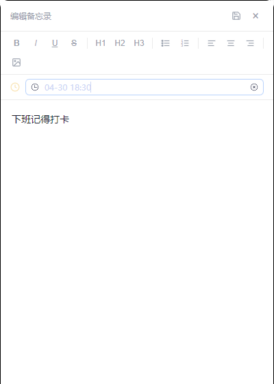
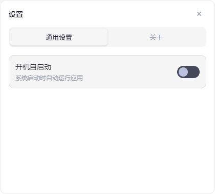

这是一款轻量级的待办任务管理软件，深度融合了待办清单与备忘录功能。核心支持任务的快速录入与精准的定时提醒，完美适配日常办公及学习场景，帮助用户实现高效的个人事务管理。

安装包下载地址：release/或者https://github.com/CKKLIN/Erzhi-todo/releases

技术栈：Vue3 + Electron + TypeScript + Element-Plus + Node.js

问题反馈wx:richman--erzhi

待办列表窗口

备忘录窗口

备忘录编辑窗口，可以设置提醒时间

设置窗口

